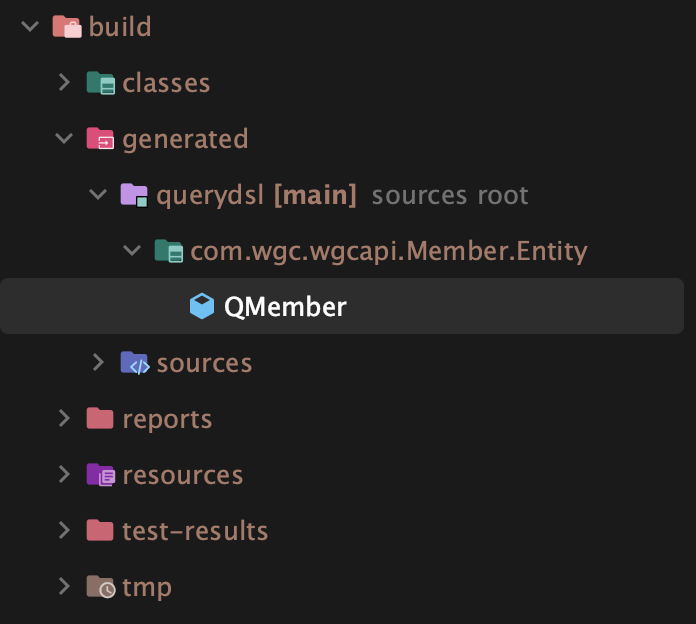

# QueryDSL QClass

---

## 개요

- QueryDSL이란?
    - Java에서 SQL과 비슷한 쿼리를 객체지향적으로 작성하도록 돕는 라이브러리.
    - Entity어노테이션이 붙은 클래스를 Query DSL이 찾아 메타 클래스를 생성(QClass)
    - 쿼리 작성시, 클래스의 메타데이터를 이용하여 IDE의 자동완성 기능을 적극적으로 사용.
    - 오타 및 문법 오류 등, 컴파일 시점에서 에러 확인 가능
    - 설정에 따라 컴파일 한 클래스들이 위치.



Entity와 QClass의 비교

```java
@Entity
@Getter
@AllArgsConstructor
@NoArgsConstructor
@EntityListeners(AuditingEntityListener.class)
public class Member {

    @Id
    @GeneratedValue(strategy = GenerationType.IDENTITY)
    private Long id;

    @Column(name = "name")
    private String name;

    @Column(name = "mail")
    private String mail;

    @Column(name = "password")
    private String password;

    @Column(name = "permission")
    private String permission = "MEMBER";

    @Column(name = "register_dt")
    @CreatedDate
    private LocalDateTime registerDateTime;

    public Member(String name, String mail, String password) {
        this.name = name;
        this.mail = mail;
        this.password = password;
    }
}
```

```java
import static com.querydsl.core.types.PathMetadataFactory.*;

import com.querydsl.core.types.dsl.*;

import com.querydsl.core.types.PathMetadata;
import javax.annotation.processing.Generated;
import com.querydsl.core.types.Path;

/**
 * QMember is a Querydsl query type for Member
 */
@Generated("com.querydsl.codegen.DefaultEntitySerializer")
public class QMember extends EntityPathBase<Member> {

    private static final long serialVersionUID = 87137392L;

    public static final QMember member = new QMember("member1");

    public final NumberPath<Long> id = createNumber("id", Long.class);

    public final StringPath mail = createString("mail");

    public final StringPath name = createString("name");

    public final StringPath password = createString("password");

    public final StringPath permission = createString("permission");

    public final DateTimePath<java.time.LocalDateTime> registerDateTime = createDateTime("registerDateTime", java.time.LocalDateTime.class);

    public QMember(String variable) {
        super(Member.class, forVariable(variable));
    }

    public QMember(Path<? extends Member> path) {
        super(path.getType(), path.getMetadata());
    }

    public QMember(PathMetadata metadata) {
        super(Member.class, metadata);
    }

}
```

## QClass 사용시 장점.

- 엔티티 클래스에 정의된 필드들을 기반으로 컴파일하여 메타 클래스 생성 → type-safe한 쿼리 작성
- 가독성과 유지보수성
    - 자바 코드로 작성되기 유지 보수성이 SQL 쿼리를 작성하는 것보다 높다.
    - 에러 발생시 컴파일 시점에서 에러를 잡기 때문에 런타임 에러를 줄일 수 있다.
- 동적 쿼리 작성에 대한 유연성 → 조건에 대한 쿼리를 동적으로 생성하여 유연한 쿼리 작성이 가능

## 단점은 뭐가 있을까

- 러닝 커브가 존재한다.
    - 쿼리 작성 방법, 메타 클래스 생성 방법, 등 러닝 커브가 존재한다.
- IDE에 의존적이다
    - 메타클래스가 가지고 있는 필드 정보들을 이용하여 쿼리를 작성하기 때문에, IDE의 자동완성 기능을 지원 받아야 장점을 극대화 할 수 있다.
- 메타 클래스 업데이트
    - 엔티티 클래스가 추가될 때 마다, 컴파일이 필요하고, 메타 클래스에 대한 업데이트가 필요하다.