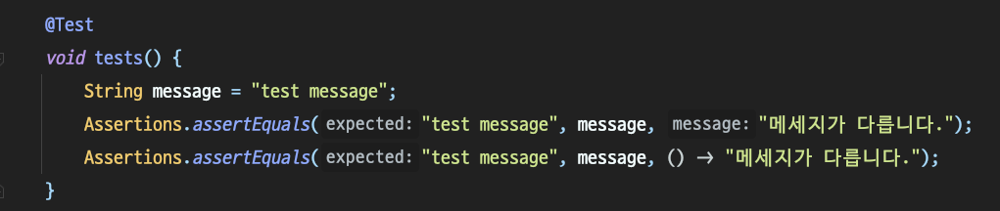

# Assertion과 Mockito

---

## Assertion

Assertion은 프로그래밍에서 디버깅,테스트 등 특정 구문이 참인지 확인하는 기능을 제공한다.

- 주의점
    - Assertion은 비즈니스 로직에 영향이 미치지 않도록 고안되도록 구성되었다고 하더라도 런타임과 다르게 메모리, 쓰레드 등 성능에 영향을 미칠 수 있는 영향이 완벽히는 같을 수 없으므로 100% 신뢰할 수는 없다.
    - 모든 테스트 커버리지를 통과하는게 아닌 이상 예상치 못한 버그의 존재가 있을 수 있고, 오히려 개발자들이 개발을 하는데에 있어서 생산성 저하를 발생시킬 수 있다.




- *`assertEquals`* 는 기댓값과 실제 값이  같은지 다른지 판별한다.
- 3번 째 인자는 테스트가 통과되지 못했을 때, 콘솔에 출력되는 메시지이다.
- 첫 번째 메시지는 일반 문자열이 들어가있고, 두 번째는 람다 표현식으로 문자열이 들어가있는데, 성능 상 두번째 방식으로 람다 표현식으로 테스트를 하는게 성능상 더 좋다.
- 무조건 실현되는 것과 실패시에만 동작하는 것에는 차이가 있기 때문에 후자가 더 좋은 선택지로 보인다.


테스트가 실패한 경우라서 실제로 메시지가 출력된 모습.

```java
int age = 20;
Assertions.assertTrue(age > 21, () -> "나이가 21보다 작습니다."); // 해당 조건이 참인지

// 내부 테스트가 전체 다 성공하는지 여부를 검증하기 위해.
Assertions.assertAll(() -> {
            Assertions.assertTrue(true, () -> "참이 아닙니다.");
            Assertions.assertThrows(IllegalArgumentException.class, () -> this.errTest(), () -> "에러를 발생시키지 않습니다.");
});

// 두 배열의 요소가 같은지 확인
int[] arr = { 1, 2, 3, 4, 5 };
int[] arr2 = { 10, 20, 30, 40, 50 };
Assertions.assertArrayEquals(arr, arr2, () -> "두 배열이 다릅니다.");
```


배열의 내부 인덱스 값이 같은지 확인하기 유용하다.

이 외에

```java
Assertions.assertNotNull(); // null이 아닌지
Assertions.assertTimeout(); // 타임아웃이 발생하는지
Assertions.assertInstanceOf(); // 타입이 일치하는지
```

등등의 메서드들로 다양한 테스트를 할 수 있다.

---

## Mockito

Mock은 가짜,모방 등의 의미를 가진다.

spring-boot-starter-test에 기본적으로 포함되어 있는 라이브러리이며, 가장 많이 사용되는 라이브러리다.

주로 Stub이라는 기술을 사용하게 되는데, Stub은 메서드의 결과를 미리 지정함을 뜻한다.

마치 직접 우리가 작성한 Service클래스에서 필요한 Repository를 주입받아 로직이 실행되는 로직을 검증해볼 수 있다.

```java
@ExtendWith(MockitoExtension.class)
class PersonServiceTest {

    @Mock
    PersonRepository personRepository;

    PersonService personService;

    @BeforeEach
    void setup() {
        this.personService = new PersonService(personRepository);
    }
}
```

- Mock 어노테이션이 붙은 객체는 초기 값이 Null이기 때문에 NPE를 예방하기 위해 Junit5와 Mockito(**MockitoExtension**)를 통합하여 사용할 수 있도록 @ExtendWith(MockitoExtension.class)를 붙여준다.

```java
@Test
    @DisplayName("mock test")
    void mock_test() {

        Optional<Person> person = Optional.of(Person.builder().firstName("doyoung").lastName("kim").build());

        when(personRepository.findById(anyLong())).thenReturn(person);

        assertEquals(personService.findById(1L).getLastName(), "kim");

        // 목 객체의 findById 가 한번 실행되었는지 검증
        verify(personRepository, times(1)).findById(1L);

        // findAll 이 한번도 실행하지 않았는지 검증
        verify(personRepository, never()).findAll();

        // 해당 Mock 이 더 이상 interactional 발생되지 않아야 한다.
        verifyNoMoreInteractions(personRepository);

    }
```

