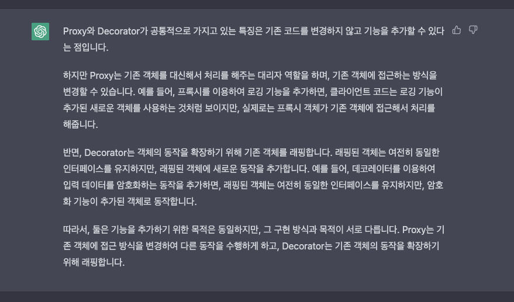

# 프록시와 데코레이터

---

## 개요

- 프록시와 데코레이터는 데이터를 처리하는 Clinet와 Server간 접근 제어, 캐싱, 부가 기능 추가 등의 요소를 처리하기 위한 방법

---

## 프록시

- 프록시는 Client와 Server의 사이에서 Server에 대한 접근 제어,라우팅,캐싱등의 요소로 활용.

### 예시

- 전 )회원 100명이 상품 A에 대한 정보 조회 → 100건의 요청에 대해 모두 쿼리 수행
    - 후) 최초 1회 요청에 대해 상품에 대해 데이터를 캐싱, 이후 99건의 요청에 대해선 캐싱된 데이터를 활용 (1번의 쿼리 수행, 99건의 요청에 대해 빠른 응답)
- 전) 특정 요청에 대한 파라미터 검증 수행 → 서비스 클래스의 복잡도 증가
    - 후) 파라미터를 검증하는 프록시 객체 생성 → 조건 불만족시,  오류 반환

[GoF](https://y-oni.tistory.com/53) 에서 설명하는 방법은 주로 접근 제어에 사용.

---

## 데코레이터

### 예시

- 실제 구현체의 데이터를 가공하거나 부가 기능을 추가하는 등 접근 제어에 대한 목적이 아니라면 데코레이터이다.
- 예시
    - 전) Controller → Service →Repository 의  클래스 다이어그램이 있고, 리포지토리의 실행 시간을 측정해야한다면
        - Controller → Service → ProxyObject → Repository 의 관계로 만들고 프록시 객체에 실행시간 측정로직 추가.
        - 여기서 중요한 점은 프록시 객체를 의존하는 서비스 클래스의 코드 변경사항은 없어야 한다.

---

## 차이점

프록시와 데코레이터는 똑같은 의미 (객체 연관 관계 중간에 삽입)을 가지고 있지만,

이 코드를 실행하는 의도(intent)에 따라 이 차이를 구분한다.

앞서 언급 했듯, 실제 구현체에 대한 접근 제어의 목적은 프록시, 데이터 전,후처리 및 신기능 추가는 데코레이터 패턴이라고 칭한다.

그리고 프록시는 대신 처리해주는 객체가 존재하며, 데코레이터는 구현체의 기능을 확장하기 위해 객체를 래핑한다. 기능 확장의 주체가 대리자 혹은 구현체에 따라 프록시와 데코레이터를 구분하기도 한다.

---

## 그럼 직접 구현해야하는가?

- 직접 구현해도 기능상 상관없이 잘 동작 하겠지만, 이 기능은 Spring의 PSA로 구현되어있는 기술이 있다.
    - 바로 스프링의 AOP가 이를 기반으로 구현한 기술
    - 스프링의 AOP는 프록시 객체를 기반으로 AOP의 정의된 내용을 토대로 동작을 수행한다.

### 스프링의 프록시 구현 예시

- 스프링의 프록시 구현 예시
    - Transcational
        - Transcational 어노테이션은 DB의 Transaction이 일어날 때, 전략을 설정할 수 있는 어노테이션.
        - 개발자는 Repository의 CRUD간의 전,후 처리 동작을 설정하지 않아도 Spring이 프록시를 사용하여 Transaction 전,후로 일종의 에러 처리를 한다고 볼 수 있다.
    - Interceptor
        - 인터셉터도 프록시의 예시 기술이다.
        - 인터셉터는 구현하게 되면 DIspatcher Servlet의 요청을 컨트롤러로 전달하기 전에 프록시 객체를 앞에 끼워넣어 데이터 전,후 처리를 가능하게 한다.

  ## 프록시와 데코레이터의 차이

  